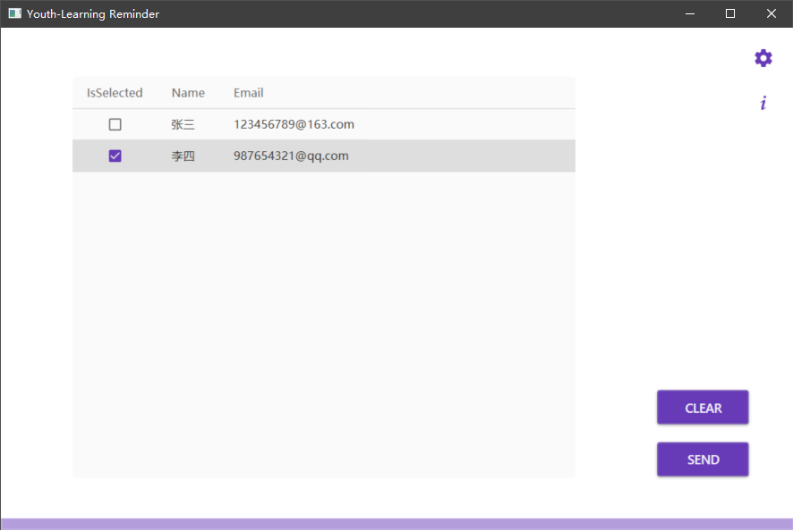
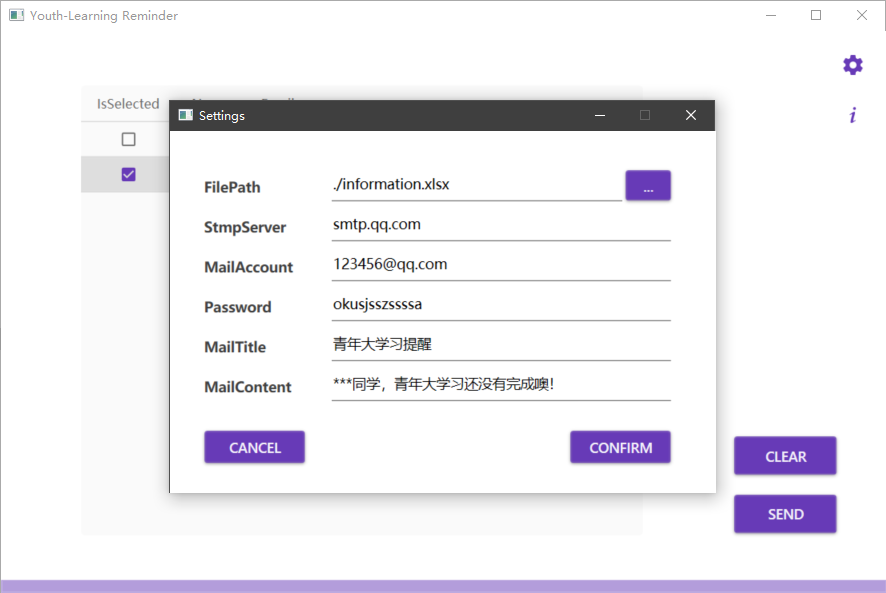

# 青年大学习提醒软件
#### 这款软件可以帮助你更方便快捷地提醒同学们完成青年大学习
## 安装
```bash
git clone https://github.com/Suasy/Youth-Learning-Reminder-Release.git
```
## 使用
双击 `YouthLearningReminder.exe` 运行软件
`如果失败，有可能是没有安装.net环境，可以网上查询解决`

## 界面说明

左侧表格的列分别是 `选择是否发送` `姓名` `邮箱` 
右侧按钮分别是 `清空选中` `发送邮件`
下面为`进度条`
## 设置说明

设置中的条目为发送方邮箱设置和发送邮件设置
条目     | 说明
-------- | -----
FilePath  | 学生信息Excel文件，可参考目录下的`infomation.xlsx`文件 
StmpServer  | 发送方smtp服务器地址，如果使用QQ邮箱就是`smtp.qq.com`
MailAccount  | 发送方邮箱账号，如`123456@qq.com`
Password  | 邮箱密码（qq邮箱此处使用授权码，其他邮箱见邮箱规定使用的是邮箱密码还是授权码`关于如何获取授权码可以在网上查询`）
MailTitle  | 邮件标题，如`青年大学习提醒`，可以添加`***`进行占位，详见下一条
MailContent  | 邮件内容，如`***同学，青年大学习还没有完成噢！`其中`***`是占位符，程序发送邮件时会替换成对应名字
## 参考
部分代码及功能实现参考自 **CSDN** 以及 **博客园** ，UI设计使用 **Material Design** 库
## 结语
感谢你的使用，有问题欢迎与我交流，可以通过 [邮箱](mailto:1348184164@qq.com)  和 [Issues](https://github.com/Suasy/Youth-Learning-Reminder-Release/issues) 与我交流，非常感谢你能读到这里！